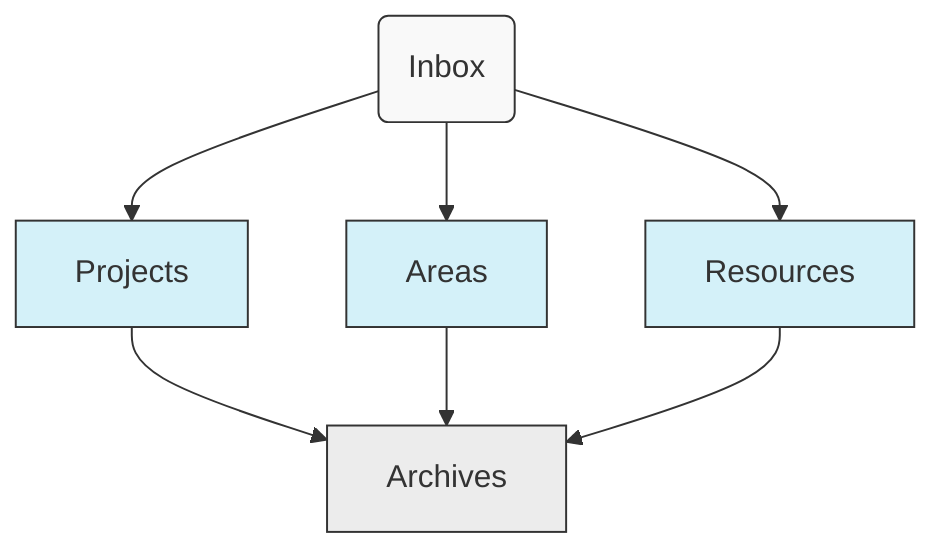

# PARA Method File Structure

<div align="center">
  
  [](https://fortelabs.co/blog/para/)
  [](https://www.fortelabs.co/)
  [](https://github.com/deathrashed/filesystem-structures)
  [](https://github.com/deathrashed/filesystem-structures)

  **A systematic approach to organizing digital information based on actionability and relevance rather than by topic or category.**
</div>

Here's a GitHub-compatible version with a text-based visualization instead of an image:


## 🧩 Core Components

### The Four Categories



1. **Projects** - Tasks with specific goals and deadlines
2. **Areas** - Ongoing responsibilities with standards to maintain
3. **Resources** - Topics of interest for future reference
4. **Archives** - Inactive items from the other categories

Plus the **Inbox** - Temporary holding area for unprocessed items

---

**PARA Flow:**
```
NEW ITEMS → Inbox → Sort into → Projects/Areas/Resources → Eventually → Archives
```

The PARA method creates a natural progression where items typically enter through your Inbox, get processed into either Projects (if actionable with deadlines), Areas (if ongoing responsibility), or Resources (if reference material), and eventually end up in Archives when no longer active.

## 🔍 Category Definitions

<details>
<summary><b>Projects</b> - Tasks with definite beginnings and ends</summary>
<p>Projects have clear outcomes and deadlines. Once completed, they move to Archives.</p>

<b>Examples:</b>
<ul>
  <li>Launch website redesign</li>
  <li>Plan vacation to Japan</li>
  <li>Complete tax returns</li>
  <li>Write research paper</li>
</ul>

<b>Characteristics:</b>
<ul>
  <li>Time-bound</li>
  <li>Has a specific deliverable or outcome</li>
  <li>Contains multiple related tasks</li>
  <li>When complete, should be archived</li>
</ul>
</details>

<details>
<summary><b>Areas</b> - Ongoing responsibilities with no end date</summary>
<p>Areas represent roles and responsibilities that require maintenance over time.</p>

<b>Examples:</b>
<ul>
  <li>Health</li>
  <li>Finances</li>
  <li>Professional Development</li>
  <li>Home Management</li>
  <li>Relationships</li>
</ul>

<b>Characteristics:</b>
<ul>
  <li>Ongoing with no end date</li>
  <li>Responsibilities you want to maintain at a certain standard</li>
  <li>Require regular attention</li>
  <li>Often contain fewer active files than Projects</li>
</ul>
</details>

<details>
<summary><b>Resources</b> - Topics or themes of ongoing interest</summary>
<p>Resources are collections of useful information on topics you're interested in.</p>

<b>Examples:</b>
<ul>
  <li>Web design</li>
  <li>Cooking recipes</li>
  <li>Product management</li>
  <li>Japanese language</li>
  <li>Interior design</li>
</ul>

<b>Characteristics:</b>
<ul>
  <li>Information-based rather than action-based</li>
  <li>Organized by topic or theme</li>
  <li>No maintenance standards or deadlines</li>
  <li>Useful for future reference</li>
</ul>
</details>

<details>
<summary><b>Archives</b> - Inactive items from other categories</summary>
<p>Archives contain completed projects, outdated areas, or resources no longer relevant.</p>

<b>Examples:</b>
<ul>
  <li>Completed projects</li>
  <li>Previous jobs</li>
  <li>Past residences</li>
  <li>Hobbies no longer pursued</li>
  <li>Reference materials for completed degrees</li>
</ul>

<b>Characteristics:</b>
<ul>
  <li>Completed or inactive</li>
  <li>Preserved for reference or legal reasons</li>
  <li>No longer requiring regular attention</li>
  <li>Maintains the same structure as their source category</li>
</ul>
</details>

<details>
<summary><b>Inbox</b> - Temporary storage before processing</summary>
<p>A holding area for new content before deciding where it belongs.</p>

<b>Characteristics:</b>
<ul>
  <li>Temporary storage only</li>
  <li>Should be regularly processed and emptied</li>
  <li>No organization within it</li>
  <li>First step in the workflow</li>
</ul>
</details>

## ✨ Benefits

<table>
  <tr>
    <td width="33%" valign="top">
      <h3>🎯 Action-Oriented</h3>
      <p>Organized by actionability rather than by subject, making it easier to focus on what needs attention now.</p>
    </td>
    <td width="33%" valign="top">
      <h3>🌐 Universal</h3>
      <p>Works for any type of digital content across different platforms, tools, and environments.</p>
    </td>
    <td width="33%" valign="top">
      <h3>🔄 Adaptive</h3>
      <p>Flexibly adjusts to changing priorities and interests while maintaining structural integrity.</p>
    </td>
  </tr>
  <tr>
    <td width="33%" valign="top">
      <h3>🧠 Reduces Cognitive Load</h3>
      <p>Four simple categories make decisions easier and reduce mental overhead.</p>
    </td>
    <td width="33%" valign="top">
      <h3>📊 Progressive Organization</h3>
      <p>Scales from beginner to advanced without needing to restructure.</p>
    </td>
    <td width="33%" valign="top">
      <h3>⏱️ Time-Efficient</h3>
      <p>Minimizes file reorganization by focusing on current relevance.</p>
    </td>
  </tr>
</table>

## 🛠️ Implementation Guide

<details>
<summary><b>Step 1: Set up the core structure</b></summary>
<pre>
mkdir -p ~/Inbox
mkdir -p ~/Projects
mkdir -p ~/Areas
mkdir -p ~/Resources
mkdir -p ~/Archives
</pre>
</details>

<details>
<summary><b>Step 2: Create second-level folders</b></summary>

<b>For Projects:</b>
<pre>
mkdir -p ~/Projects/Active
mkdir -p ~/Projects/On_Hold
mkdir -p ~/Projects/Upcoming
</pre>

<b>For Areas:</b>
<pre>
mkdir -p ~/Areas/Health
mkdir -p ~/Areas/Finances
mkdir -p ~/Areas/Career
mkdir -p ~/Areas/Home
mkdir -p ~/Areas/Relationships
mkdir -p ~/Areas/Personal_Development
</pre>

<b>For Resources:</b>
<pre>
mkdir -p ~/Resources/Interests
mkdir -p ~/Resources/Knowledge_Base
mkdir -p ~/Resources/Collections
mkdir -p ~/Resources/Culture
mkdir -p ~/Resources/Software
</pre>

<b>For Archives:</b>
<pre>
mkdir -p ~/Archives/Projects
mkdir -p ~/Archives/Areas
mkdir -p ~/Archives/Resources
</pre>
</details>

<details>
<summary><b>Step 3: Set up workflow automation (optional)</b></summary>
<p>Consider using automation tools to help maintain your PARA structure:</p>

<ul>
  <li>Create automated rules to move completed projects to Archives</li>
  <li>Set up weekly review reminders to process items in your Inbox</li>
  <li>Use tagging or metadata systems for cross-referencing across categories</li>
  <li>Implement search tools that respect the PARA structure</li>
</ul>
</details>

## 📋 Maintenance Best Practices

1. **Weekly Review** - Spend 30 minutes weekly processing your Inbox and updating Projects
2. **Monthly Review** - Review Areas and ensure they're properly maintained
3. **Quarterly Review** - Evaluate Resources for relevance and archive completed Projects
4. **Yearly Review** - Clean up Archives and ensure the overall system still serves your needs
5. **Clear Inbox Daily** - Process new items into the appropriate category regularly
6. **Use Cross-Linking** - Create connections between related items across categories

## 📚 Origin & Resources

<div align="center">
  <a href="https://www.buildingasecondbrain.com/">
    
  </a>
</div>

### About PARA Method

The PARA method was created by productivity expert [Tiago Forte](https://fortelabs.com/about/) as part of his "Building a Second Brain" methodology for personal knowledge management. It focuses on organizing information by actionability rather than by subject.

> "The most important question when it comes to organizing information is not _where_ to put something, but _how_ you want to use it."
> — Tiago Forte

### Key Resources

- 📝 [The PARA Method on Forte Labs](https://fortelabs.co/blog/para/) - Original article explaining the system
- 📘 [Building a Second Brain Book](https://www.buildingasecondbrain.com/) - Comprehensive guide to the methodology
- 🎬 [PARA Method Explained (YouTube)](https://www.youtube.com/watch?v=SjZSy8s2VEE) - Visual explanation of the system
- 🧰 [PARA in Practice](https://fortelabs.com/blog/para-in-practice-an-interview-with-a-new-para-convert/) - Real-world implementation examples

## 🔄 Workflow Examples

<details>
<summary><b>Example Workflow: New Work Project</b></summary>
<ol>
  <li>Create folder in Projects/Active named "Website Redesign"</li>
  <li>Move relevant reference materials from Resources to the project folder</li>
  <li>Create subfolders for different aspects (e.g., "Designs", "Content", "Technical")</li>
  <li>When completed, move entire folder to Archives/Projects</li>
</ol>
</details>

<details>
<summary><b>Example Workflow: Interesting Article</b></summary>
<ol>
  <li>Save article to Inbox</li>
  <li>During weekly review, determine if it's related to a Project, Area, or Resource</li>
  <li>Move to appropriate location and categorize</li>
  <li>Consider extracting key information if it's particularly valuable</li>
</ol>
</details>

---

<div align="center">
  <p><i>"Organizing information for effective action."</i></p>
  <a href="https://fortelabs.co/"></a>
</div>
